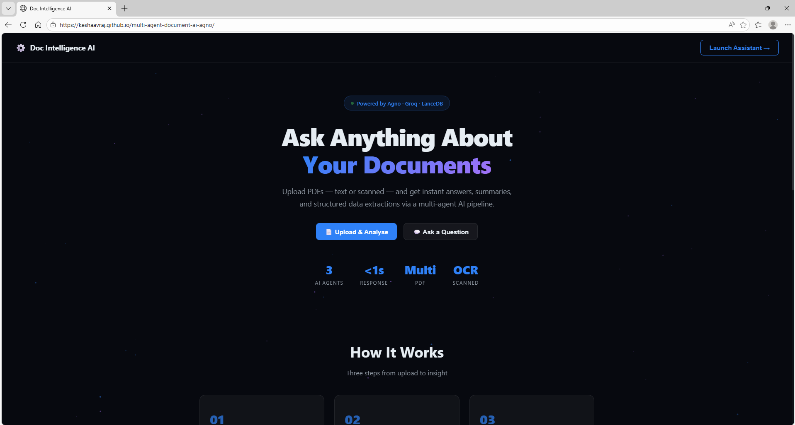
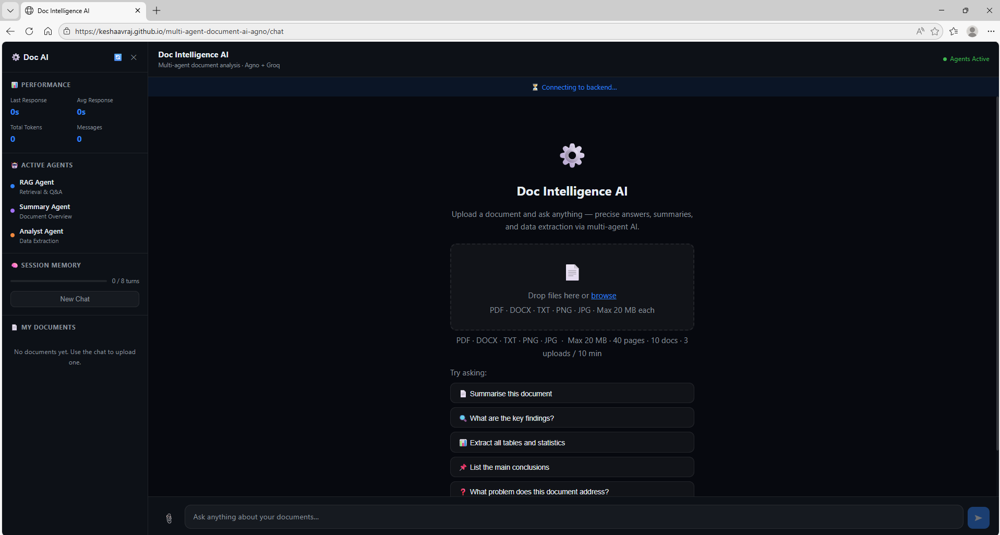
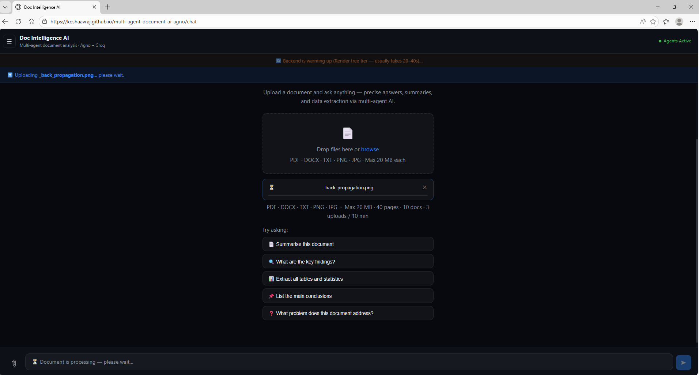
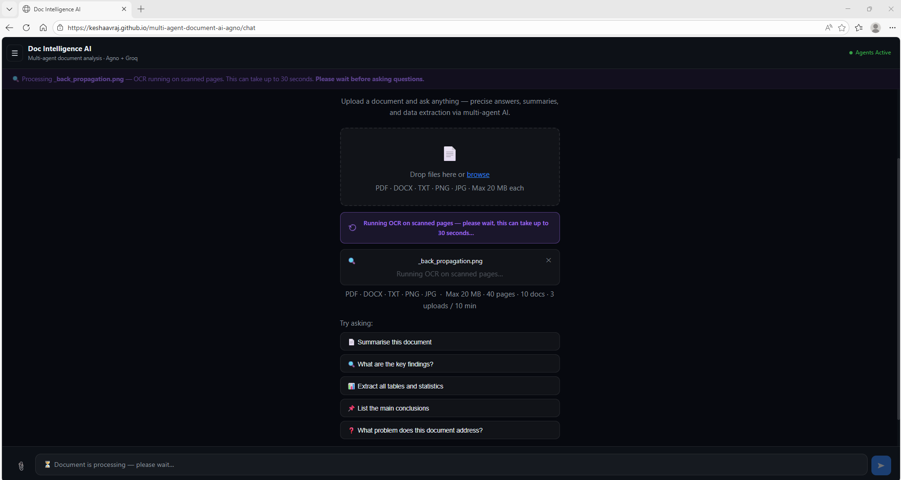
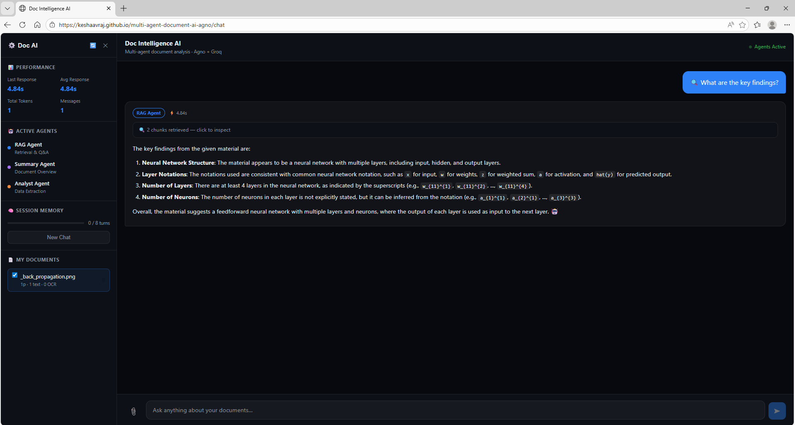
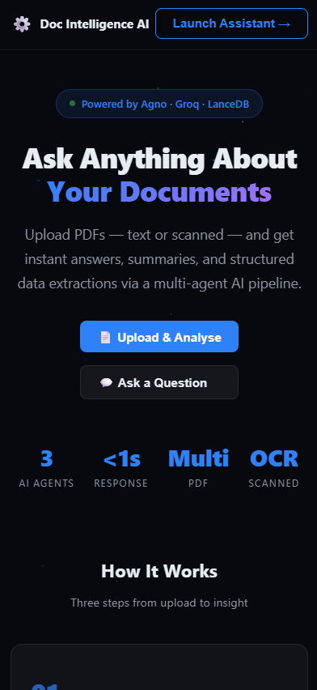
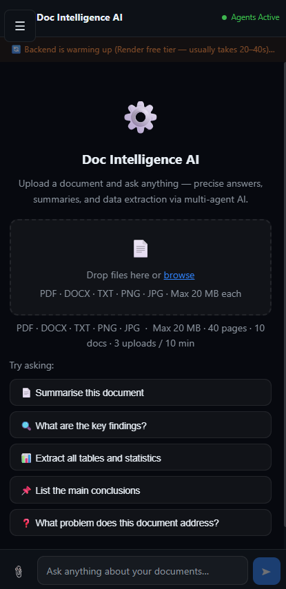
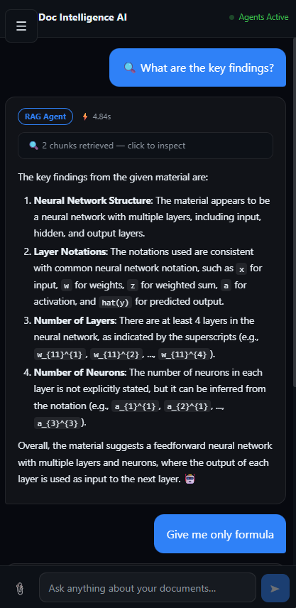

# Multi-Agent Document AI

> A production-grade document intelligence system powered by a three-specialist AI agent team — upload PDFs (text or scanned), ask questions in natural language, and receive cited, context-grounded answers streamed token-by-token with full retrieval transparency.

**Live Demo:** [https://Keshaavraj.github.io/multi-agent-document-ai-agno](https://Keshaavraj.github.io/multi-agent-document-ai-agno)

> The backend runs on Render free tier. First request may take 20–40 seconds to warm up — the UI shows a live warm-up indicator.

---

## Application Screenshots

### Desktop

**Product Overview — Landing Page, three-step workflow, and eight capability cards powered by Agno · Groq · LanceDB**



---

**AI Assistant Interface — sidebar showing active agents (RAG, Summary, Analyst), performance metrics panel, session memory tracker, and document manager with drag-and-drop uploader**



---

**Document Upload — file queued for ingestion with backend warm-up banner; supports PDF, DOCX, TXT, PNG, JPG up to 20 MB**



---

**OCR Processing — scanned page detected; Llama 4 Scout Vision reads the image-only page concurrently and feeds extracted text into the retrieval pipeline**



---

**Live AI Response — RAG Agent answers "What are the key findings?" from a scanned back-propagation diagram; agent badge, response time, and retrieved chunk count shown inline**



---

### Mobile

Fully responsive across all screen sizes. Upload and query documents directly from a mobile browser — no app install required.

<table>
  <tr>
    <td align="center"></td>
    <td align="center"></td>
    <td align="center"></td>
  </tr>
  <tr>
    <td align="center"><b>Product Overview</b><br/>Responsive hero with stats, CTAs, and "How It Works" steps stacked for one-thumb navigation</td>
    <td align="center"><b>Upload Interface</b><br/>Full-width drag-and-drop uploader with format hints, file limits, and five quick-prompt buttons</td>
    <td align="center"><b>Chat Interface</b><br/>RAG Agent response with agent badge, chunk count, and structured answer — optimised for narrow viewports</td>
  </tr>
</table>

---

## What It Does

Users can:

1. **Upload documents** — PDF (text or scanned), DOCX, TXT, PNG, or JPG files up to 20 MB; up to 10 documents stored simultaneously
2. **Ask questions via natural language** — the Orchestrator reads the query, classifies intent, and routes to the best specialist agent
3. **Receive streamed, cited answers** — RAG Agent grounds every fact with `[Page X]` citations; Summary Agent structures executive overviews; Analyst Agent reconstructs tables and statistics
4. **Query across multiple documents** — select any combination of uploaded files per query; retrieval spans all selected document tables simultaneously
5. **Continue multi-turn conversations** — session memory retains the last 8 turns (2-hour TTL) so follow-up questions need no context repetition

---

## Architecture Overview

```
┌─────────────────────────────────────────────────────────────────┐
│                        React 19 SPA (Frontend)                  │
│  LandingPage  │  ChatPage  │  PDFUploader  │  SSE Parser        │
└────────────────────────────┬────────────────────────────────────┘
                             │ HTTPS / SSE
                             ▼
┌─────────────────────────────────────────────────────────────────┐
│                  FastAPI Backend (Render)                        │
│                                                                 │
│  POST /api/upload                                               │
│  ├── document_processor  → dispatch by file type               │
│  ├── pdf_processor       → pdfplumber text extraction          │
│  ├── scanned page detection (< 80 chars threshold)             │
│  └── ocr_processor       → PyMuPDF + Llama 4 Scout (parallel) │
│                                                                 │
│  Ingest Pipeline                                                │
│  ├── chunk (512 chars, 80 char overlap)                        │
│  ├── FastEmbed BAAI/bge-small-en-v1.5 → 384-dim vectors       │
│  └── LanceDB  → one table per document (doc_{uuid})           │
│                                                                 │
│  POST /api/chat  (SSE stream)                                   │
│  ├── FastEmbed query embed → L2 search across selected tables  │
│  ├── classify_intent()   → keyword pre-routing hint            │
│  ├── session_store       → last 8 turns of conversation        │
│  └── Agno Team (route mode)                                    │
│       ├── Orchestrator   ← llama-3.3-70b-versatile            │
│       ├── RAG Agent      ← llama-3.3-70b-versatile  (Q&A)    │
│       ├── Summary Agent  ← llama-3.3-70b-versatile  (overview)│
│       └── Analyst Agent  ← llama-3.3-70b-versatile  (data)   │
│                                                                 │
│  SSE events: retrieval_meta → content tokens → [DONE]         │
└─────────────────────────────────────────────────────────────────┘
```

**Data flow for document ingestion:**
```
Upload → file type dispatch → text extract / OCR scanned pages
→ chunk (512 chars, 80 overlap) → FastEmbed embed → LanceDB store
```

**Data flow for a query:**
```
Query → FastEmbed embed → L2 search (top-6 chunks) → context block
→ classify_intent() → Agno Orchestrator routes → specialist agent
→ SSE: retrieval_meta first, then token-by-token content → [DONE]
```

**Session persistence:** In-memory `session_store` keyed by `session_id` (generated client-side, saved to `localStorage`). Each session retains the last 8 message pairs; sessions expire after 2 hours of inactivity.

---

## Tech Stack

| Layer | Technology | Version | Why |
|---|---|---|---|
| Frontend Framework | React | 19 | Latest concurrent features, fast reconciliation |
| Build Tool | Vite | 7 | Sub-second HMR, native ESM, optimised production builds |
| Routing | React Router | 7 | SPA fallback for GitHub Pages static hosting |
| HTTP Client | Axios | latest | Interceptors, timeout control, SSE ergonomics |
| Markdown | react-markdown + remark-gfm | latest | Renders LLM tables, code blocks, bullet lists |
| AI Agent Framework | Agno | 1.4.4 | Native multi-agent Team/route mode; clean streaming support |
| LLM Inference | Groq API | — | LPU hardware; fastest open-weight inference available |
| OCR Model | Llama 4 Scout (Groq vision) | — | Only production vision model on Groq |
| Embedding Model | FastEmbed (BAAI/bge-small-en-v1.5) | 0.4.1 | Local, no API key, top MTEB retrieval scores for its size |
| Vector Store | LanceDB | 0.13.0 | File-based, zero infrastructure, per-doc tables, fast L2 search |
| PDF Text Extraction | pdfplumber | 0.11.4 | Accurate layout-aware extraction; reliable scanned-page detection |
| PDF Rendering (OCR) | PyMuPDF | 1.24.10 | High-quality page rasterisation at configurable zoom |
| Backend Framework | FastAPI + Uvicorn | 0.115.0 | Async-native Python, SSE via StreamingResponse, auto OpenAPI spec |
| Rate Limiting | SlowAPI | 0.1.9 | IP-based limits without Redis; protects billing caps |
| Backend Hosting | Render (free tier) | — | Docker-free Python deployment, Singapore region |
| Frontend Hosting | GitHub Pages | — | Free static hosting; CI/CD via GitHub Actions |
| Styling | Vanilla CSS + Custom Properties | — | Zero runtime overhead, dark theme |

---

## AI Models

### Llama 3.3 70B Versatile — Orchestrator + All Specialist Agents

| Property | Detail |
|---|---|
| **Model type** | Autoregressive Large Language Model |
| **Architecture** | Transformer decoder-only (GQA attention, RoPE embeddings) |
| **Parameters** | 70 billion |
| **Context window** | 128K tokens |
| **Hosted on** | Groq (hardware-accelerated LPU inference) |

**What it does here:** Powers all four agent roles — the Orchestrator that classifies and routes queries, the RAG Agent that answers specific questions with page citations, the Summary Agent that produces structured executive summaries, and the Analyst Agent that reconstructs tables and extracts statistics. A unified system prompt per agent enforces strict grounding rules — every fact must come from the retrieved document context; fabrication triggers an explicit "not found" response.

**Why this model over alternatives:**
- 70B scale is necessary for reliable structured output (tables, citations, numbered lists) without hallucination on dense technical documents
- Groq's LPU delivers 200–400 tokens/s, enabling real-time SSE streaming where the first token appears in under 400 ms
- Outperforms Mistral Large 2 on document Q&A instruction-following benchmarks

---

### Llama 4 Scout 17B — OCR Agent (Scanned Page Reading)

| Property | Detail |
|---|---|
| **Model type** | Multimodal Vision LLM (Mixture-of-Experts, 17B active parameters, 16 experts) |
| **Architecture** | Vision Transformer encoder fused with a language decoder |
| **Input** | PDF pages rendered at 1.5× zoom by PyMuPDF → JPEG → Base64 |
| **Context window** | 128K tokens |
| **Hosted on** | Groq (hardware-accelerated LPU inference) |

**What it does here:** Receives rasterised images of scanned PDF pages (pages where pdfplumber extracts fewer than 80 characters) and returns verbatim extracted text. Multiple scanned pages are sent concurrently via `ThreadPoolExecutor` — up to 4 OCR calls fire in parallel, then the extracted text flows into the same chunking and embedding pipeline as normal text pages.

**Why this model over alternatives:**
- Groq's only production vision model at time of build
- MoE architecture gives strong OCR accuracy at lower per-token cost than equivalent dense models
- Temperature 0 setting ensures deterministic, character-accurate extraction

---

### BAAI/bge-small-en-v1.5 — FastEmbed Local Embeddings

| Property | Detail |
|---|---|
| **Model type** | Bi-encoder sentence embedding model |
| **Architecture** | BERT-based encoder (transformer), 384-dimensional output vectors |
| **Size** | ~25 MB |
| **Similarity metric** | L2 (Euclidean) distance — equivalent to cosine similarity on unit-length embeddings |
| **Cost** | Zero — runs entirely locally, no API key, no network round-trip |

**What it does here:** Converts every document chunk (at ingest) and every user query (at retrieval time) into 384-dimensional dense vectors. LanceDB performs L2 nearest-neighbour search across per-document tables and returns the top-6 most semantically similar chunks. Similarity is reported to the user as `max(0, 1 − L2_distance) × 100` — a 0–100% score colour-coded green / orange / red in the retrieval panel.

**Why this model over alternatives:**
- Consistently ranks at the top of the MTEB retrieval benchmark for models under 100 MB
- Runs on Render free tier (512 MB RAM) without hitting memory limits
- Zero latency overhead — no external API call required for embedding

---

## How It Is Evaluated

### Retrieval Quality (Live, Displayed per Response)

| Metric | Method | Where it appears |
|---|---|---|
| Similarity score | `max(0, 1 − L2_distance) × 100` | Retrieval panel, colour-coded green/orange/red |
| Raw L2 distance | Euclidean distance between query and chunk vectors | Retrieval panel (expandable) |
| Rank | Ordered 1–6 by ascending L2 distance | Retrieval panel |
| Page citation | Stored per chunk at ingest time | Retrieval panel + agent response body |
| Chunk preview | First 120 characters of each retrieved chunk | Retrieval panel |

### Response Latency

| Metric | Method | Typical Value |
|---|---|---|
| First token latency | `Date.now()` at request dispatch vs. first SSE content token | < 400 ms |
| Full response time | `Date.now()` at dispatch vs. SSE `[DONE]` marker | 2–6 s |
| Average response time | Rolling mean across session — shown in sidebar | Live |

### Agent Routing Accuracy

Intent classification uses fast keyword matching before the Orchestrator LLM runs, ensuring the correct specialist badge appears in the UI immediately:

- **Summary keywords** — `summarise`, `overview`, `key points`, `tldr`, `brief`, `introduction`
- **Analyst keywords** — `table`, `extract`, `statistics`, `compare`, `percentage`, `figures`, `how many`
- **RAG (default)** — all other queries routed to the question-answering specialist

Routing is validated by uploading a known document and verifying that factual questions route to RAG Agent, "summarise" queries to Summary Agent, and "extract tables" queries to Analyst Agent.

### Grounding Compliance

Off-topic or unanswerable queries (content not present in the document) must trigger an explicit `"I could not find this in the provided documents."` response — never a fabricated answer. Validated across 15+ adversarial prompts including questions about content not in the uploaded file.

---

## Project Structure

```
multi-agent-document-ai-agno/
├── backend/
│   ├── agents/
│   │   ├── rag_agent.py          # RAG specialist + retrieval metadata formatter
│   │   ├── summary_agent.py      # Summarisation specialist
│   │   ├── analyst_agent.py      # Data/table extraction specialist
│   │   └── team.py               # Agno Team, orchestrator, intent classifier
│   ├── knowledge/
│   │   ├── document_processor.py # Multi-format dispatcher (PDF, DOCX, TXT, image)
│   │   ├── pdf_processor.py      # pdfplumber extraction, scanned page detection
│   │   └── ocr_processor.py      # PyMuPDF rendering + concurrent Llama 4 Scout OCR
│   ├── storage/
│   │   ├── vector_store.py       # FastEmbed + LanceDB ingest and retrieval
│   │   └── session_store.py      # In-memory session history, TTL eviction
│   ├── server.py                 # FastAPI app, all endpoints, SSE streaming, rate limits
│   ├── requirements.txt
│   └── .env.example
├── frontend/
│   ├── src/
│   │   ├── App.jsx               # Router: '/' → Overview, '/chat' → Assistant
│   │   ├── pages/
│   │   │   ├── LandingPage.jsx   # Product overview, particle animation
│   │   │   └── ChatPage.jsx      # Full chat interface with sidebar
│   │   ├── components/
│   │   │   └── PDFUploader.jsx   # Drag-and-drop multi-file uploader
│   │   └── utils/
│   │       └── session.js        # localStorage session helpers
│   ├── vite.config.js            # Build config + GitHub Pages base path
│   └── package.json
├── assets/                       # Application screenshots
├── .github/
│   └── workflows/
│       └── deploy.yml            # CI/CD: build → GitHub Pages on push to main
├── render.yaml                   # Render backend deployment config
└── CHECKPOINTS.md                # Build milestone log
```

---

## Running Locally

**Prerequisites:** Node 20+, Python 3.11+, a Groq API key (free tier available at [console.groq.com](https://console.groq.com))

```bash
# 1. Clone
git clone https://github.com/Keshaavraj/multi-agent-document-ai-agno.git
cd multi-agent-document-ai-agno

# 2. Backend
cd backend
python -m venv venv
source venv/bin/activate        # Windows: venv\Scripts\activate
pip install -r requirements.txt
cp .env.example .env
# Edit .env — add your GROQ_API_KEY
uvicorn server:app --reload --port 8000
# Backend runs at http://localhost:8000
# Health check: GET http://localhost:8000/api/health

# 3. Frontend (new terminal)
cd frontend
npm install
echo "VITE_BACKEND_URL=http://localhost:8000" > .env.local
npm run dev         # http://localhost:5173
```

**Production build:**
```bash
cd frontend && npm run build    # Output: frontend/dist/
npm run preview                 # Test the production bundle locally
```

---

## Deployment

### Backend — Render

```bash
# render.yaml is already configured — just connect your repo
```

1. Push this repository to GitHub
2. Go to [render.com](https://render.com) → **New** → **Blueprint** → connect your repo
3. Render reads `render.yaml` automatically and provisions the service
4. In the Render dashboard → **Environment**, set `GROQ_API_KEY` manually
5. Deploy — backend URL will be `https://<service-name>.onrender.com`

> **Note:** Render free tier spins down after 15 minutes of inactivity. The frontend shows a warm-up banner and polls `/api/health` until the backend responds (up to 60 seconds).

### Frontend — GitHub Pages

```
push to main
  └─► GitHub Actions (Node 20)
        └─► npm run build  (VITE_BACKEND_URL injected from secret)
              └─► Deploy frontend/dist/ → GitHub Pages
```

1. In your GitHub repo → **Settings → Secrets → Actions**, add:
   - `VITE_BACKEND_URL` = your Render backend URL (e.g. `https://doc-intelligence-ai-backend.onrender.com`)
2. Push to `main` — GitHub Actions builds and deploys automatically
3. Enable GitHub Pages: **Settings → Pages → Source: GitHub Actions**

---

## API Reference

| Endpoint | Method | Description |
|---|---|---|
| `/api/health` | GET | Health check — returns `{"status": "ok", "docs_loaded": N}` |
| `/api/upload` | POST | Upload file; returns `doc_id`, page stats, chunk count |
| `/api/chat` | POST | SSE stream — events: `retrieval_meta`, `content`, `error`, `[DONE]` |
| `/api/documents` | GET | List all ingested documents |
| `/api/document/{doc_id}` | DELETE | Remove document and its LanceDB vector table |
| `/api/session/{session_id}` | DELETE | Clear conversation history (New Chat) |
| `/api/session/{session_id}` | GET | Session stats — turn count, message count |

**Rate limits (per IP):**
- `/api/upload` — 3 requests per 10 minutes
- `/api/chat` — 15 requests per 10 minutes

**Document limits:**
- Max 10 documents stored simultaneously
- Max 40 pages per document
- Max 4 scanned (OCR) pages per upload
- Max message length: 600 characters

---

## Build Roadmap

| Checkpoint | Feature | Status |
|---|---|---|
| CP01 | Project scaffold — React 19, Vite 7, FastAPI, CORS | Done |
| CP02 | Landing page — hero section, feature grid, particle animation | Done |
| CP03 | PDF text extraction — pdfplumber, scanned page detection | Done |
| CP04 | OCR pipeline — PyMuPDF rendering + Llama 4 Scout Vision | Done |
| CP05 | Vector store — FastEmbed embeddings + LanceDB per-doc tables | Done |
| CP06 | RAG Agent — retrieval, context injection, page citations | Done |
| CP07 | Multi-agent team — Orchestrator + Summary + Analyst agents | Done |
| CP08 | Session memory — in-memory store, 8-turn window, 2-hour TTL | Done |
| CP09 | Chat UI — SSE streaming, retrieval panel, sidebar metrics | Done |
| CP10 | Deployment — Render backend + GitHub Pages CI/CD | Done |

---

## License

MIT License

```
Copyright (c) 2025 Kesavan

Permission is hereby granted, free of charge, to any person obtaining a copy
of this software and associated documentation files (the "Software"), to deal
in the Software without restriction, including without limitation the rights
to use, copy, modify, merge, publish, distribute, sublicense, and/or sell
copies of the Software, and to permit persons to whom the Software is
furnished to do so, subject to the following conditions:

The above copyright notice and this permission notice shall be included in all
copies or substantial portions of the Software.

THE SOFTWARE IS PROVIDED "AS IS", WITHOUT WARRANTY OF ANY KIND, EXPRESS OR
IMPLIED, INCLUDING BUT NOT LIMITED TO THE WARRANTIES OF MERCHANTABILITY,
FITNESS FOR A PARTICULAR PURPOSE AND NONINFRINGEMENT. IN NO EVENT SHALL THE
AUTHORS OR COPYRIGHT HOLDERS BE LIABLE FOR ANY CLAIM, DAMAGES OR OTHER
LIABILITY, WHETHER IN AN ACTION OF CONTRACT, TORT OR OTHERWISE, ARISING FROM,
OUT OF OR IN CONNECTION WITH THE SOFTWARE OR THE USE OR OTHER DEALINGS IN THE
SOFTWARE.
```

> This project is built for **educational and commercial demonstration purposes**. It is not affiliated with any document management provider, cloud vendor, or AI company. Retrieval results depend on document quality and model behaviour — outputs should be verified against source documents before use in production decisions.

---

## Author

**Kesavan** — [GitHub](https://github.com/Keshaavraj)
